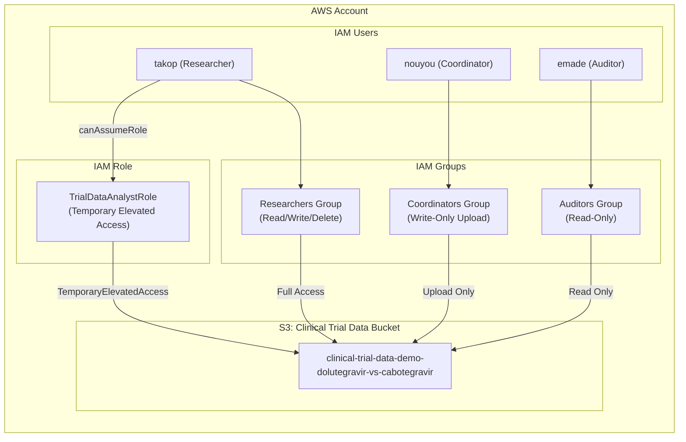

# AWS Identity and Access Management In Clinical Trial Setup

[](https://github.com/Nouyou)

This project demonstrates **AWS Identity and Access Management (IAM)** using Terraform to manage access for staff involved in a simulated clinical trial for HIV treatment. It showcases real-world best practices for **least privilege access, role-based access control, and secure S3 data storage**.

---

## Scenario

We simulate a double-blinded controlled clinical trial testing two HIV drugs:

- **Drug A:** Dolutegravir  
- **Drug B:** Cabotegravir  

Clinical trial data is stored in an **AWS S3 bucket**, with staff access managed via IAM groups and policies. Different staff roles have restricted permissions:

| Role         | IAM User | Access Permissions                     |
|--------------|----------|---------------------------------------|
| Researcher   | `takop`  | Full read/write/delete access to S3    |
| Coordinator  | `nouyou` | Write-only access to S3 (upload data) |
| Auditor      | `emade`  | Read-only access to S3                 |

Additionally, the **`TrialDataAnalystRole`** can be assumed by `takop` for temporary elevated access to perform advanced analysis.


---

## Project Structure

---

## Architecture Diagram

Below is the visual representation of the IAM access model for the clinical trial:


## Terraform Overview

The Terraform configuration does the following:

1. **Provider Block** – specifies AWS account profile (`cloud-admin`) and region (`us-east-1`).  
2. **S3 Bucket** – creates `clinical-trial-data-demo-dolutegravir-vs-cabotegravir` with private access.  
3. **IAM Groups** – creates groups for `researchers`, `coordinators`, and `auditors`.  
4. **IAM Users** – adds users `takop`, `nouyou`, and `emade`.  
5. **Group Memberships** – assigns users to appropriate groups.  
6. **IAM Policies** – defines and attaches policies for each group based on access level.  
7. **IAM Role** – `TrialDataAnalystRole` that `takop` can assume for elevated access.  
8. **Outputs** – displays bucket name and analyst role ARN after apply.

---

## Getting Started

### Prerequisites

- Windows PowerShell  
- [Terraform](https://developer.hashicorp.com/terraform/downloads) (v1.x)  
- [AWS CLI v2](https://aws.amazon.com/cli/)  
- AWS account with IAM user configured (`cloud-admin` profile)  

### Initialize Terraform

```powershell
cd terraform
terraform init
